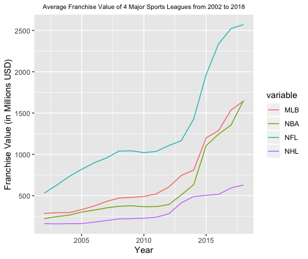

#### README

Creating a plot in R of the average franchise values from 2002-2018 for the four major sports leagues in America.

Made to explore using ggplot2 in R.

The resulting plot follows.

##### Sources
[NBA](https://www.statista.com/statistics/193442/average-franchise-value-in-the-nba-since-2000/)

[NFL](https://www.statista.com/statistics/193435/average-franchise-value-in-the-nfl-since-2000/)

[NHL](https://www.statista.com/statistics/193443/average-franchise-value-nhl/)

[MLB](https://www.statista.com/statistics/193441/average-franchise-value-in-mlb-since-2000/)

